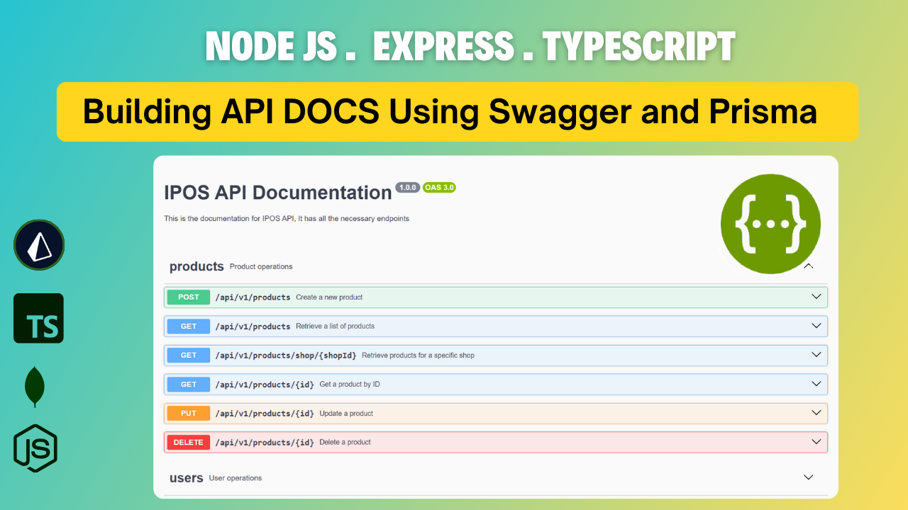
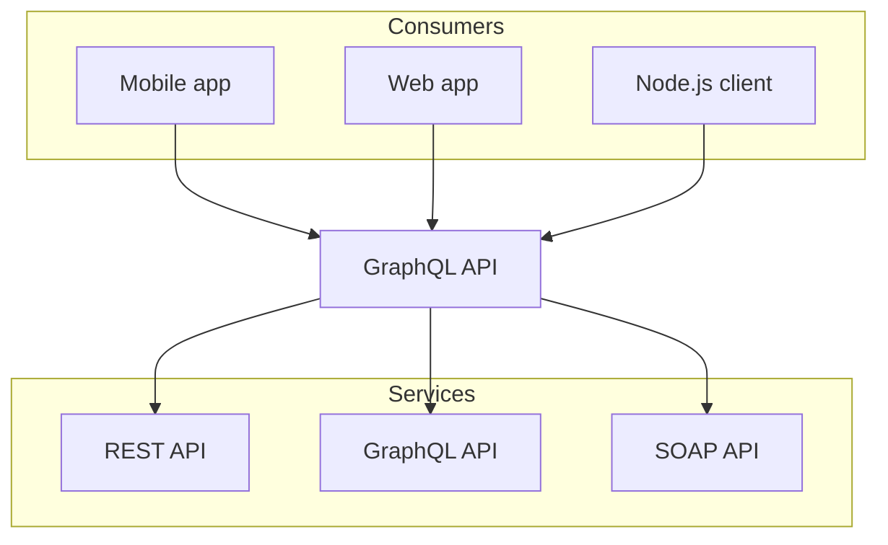

import { Tabs, Tab } from "nextra/components";
import Image from "next/image";

# Install Tailwind CSS with Next.js

Setting up Tailwind CSS in a Next.js project.

<Tabs items={["Step 1", "Step 2","Step 3"]}>
  <Tab>
    ### Step 1 Create your project Start by creating a new Next.js project if
    you don’t have one set up already. The most common approach is to use Create
    Next App.

```bash copy filename=">Terminal"
npx create-next-app@latest my-projec --typescript --eslint
cd my-project
```

  </Tab>
  <Tab>
  ### Install Tailwind CSS 
  Install tailwindcss and its peer dependencies via npm, and then run the init command to generate both `tailwind.config.js` and `postcss.config.js`.

```bash copy filename=">Terminal"
npm install -D tailwindcss postcss autoprefixer
npx tailwindcss init -p
```

  </Tab>

  <Tab>
  ### Configure your template paths
  Add the paths to all of your template files in your `tailwind.config.js file`.

```js copy filename="tailwind.config.js"
/** @type {import('tailwindcss').Config} */
module.exports = {
  content: [
    "./app/**/*.{js,ts,jsx,tsx,mdx}",
    "./pages/**/*.{js,ts,jsx,tsx,mdx}",
    "./components/**/*.{js,ts,jsx,tsx,mdx}",

    // Or if using `src` directory:
    "./src/**/*.{js,ts,jsx,tsx,mdx}",
  ],
  theme: {
    extend: {},
  },
  plugins: [],
};
```

  </Tab>
</Tabs>



{/* <Image src="/thumbnail.png" alt="Description" width={500} height={300} /> */}

<iframe
  width="100%"
  height="450"
  src="https://www.youtube.com/embed/cg99WEMNAqc?si=JRw1HseHs48aISCq"
  frameborder="0"
  style={{ marginTop: "60px" }}
  allowfullscreen
></iframe>

import { FileTree } from "nextra/components";

<FileTree>
  <FileTree.Folder name="pages" defaultOpen>
    <FileTree.File name="index.md" />
    <FileTree.File name="about.md" />
    <FileTree.Folder name="docs">
      <FileTree.File name="getting-started.md" />
    </FileTree.Folder>
  </FileTree.Folder>
</FileTree>

import { Steps } from "nextra/components";

<Steps>
  ### Step 1 
  Do this first This some Content for step 1

### Step 2 Then do this

This is some content for step 2

### Step 3 Finally

This is some content for step 3

</Steps>

<Tabs items={["Tab 1", "Tab 2"]}>
  <Tab>Content for Tab 1</Tab>
  <Tab>Content for Tab 2</Tab>
</Tabs>

import { Card, Cards } from "nextra/components";

<Cards>
  <Card title="Card 1" href="/link1">
    Description for Card 1
  </Card>
  <Card title="Card 2" href="/link2">
    Description for Card 2
  </Card>
</Cards>

## Mermaid Diagram


